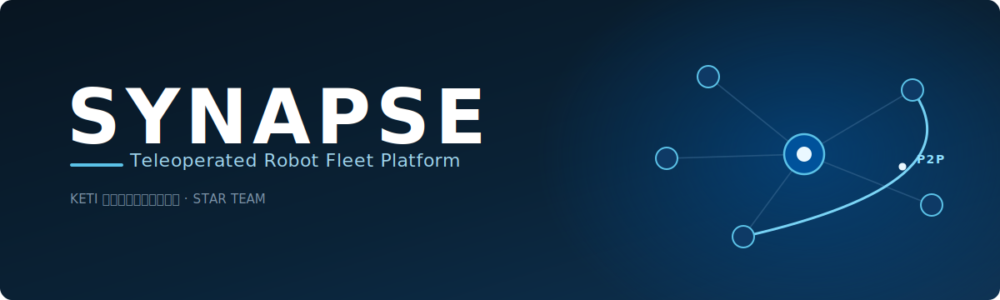
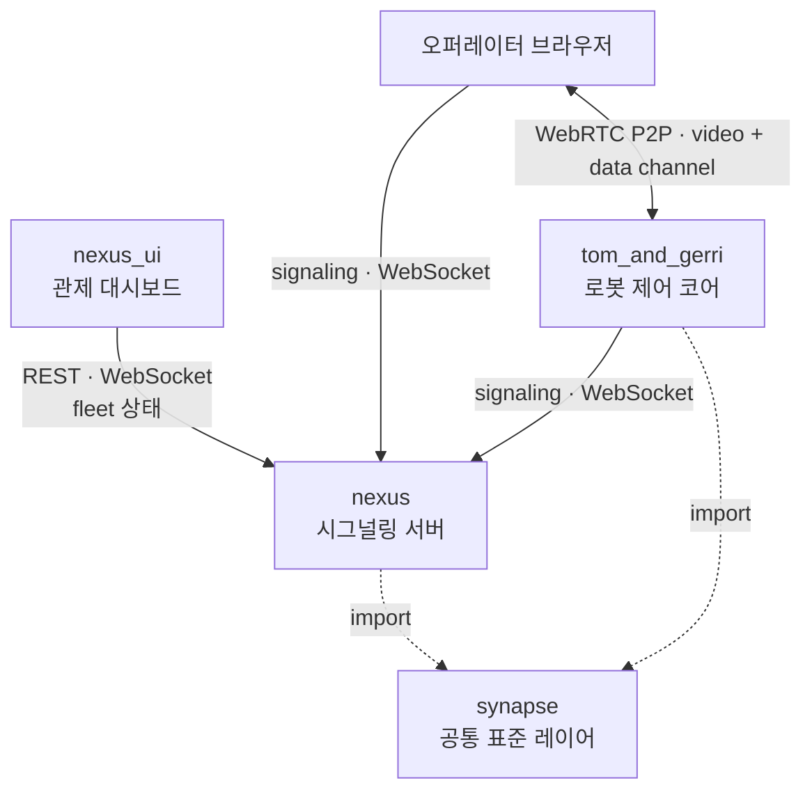

  

---

## 개요

오퍼레이터와 로봇은 **WebRTC P2P**로 직접 연결됩니다. 서버(`nexus`)는 연결을 맺어주는 **시그널링**과 **fleet 상태 중개**만 담당하며, 영상·명령 같은 미디어는 서버를 거치지 않습니다. 네트워크가 끊겨도 연결은 **자동으로 복구**됩니다.

## 아키텍처

`nexus`는 offer/answer/ICE 교환만 중개합니다. 핸드셰이크가 끝나면 오퍼레이터와 `tom_and_gerri`는 서버를 거치지 않고 P2P 채널로 직접 통신합니다. 즉 **서버는 미디어 트래픽의 경로에 들어가지 않으며**, 연결 수립과 상태 동기화에만 관여합니다.

## 레포지토리

| 레포 | 역할 | 설명 | 언어 |
|---|---|---|---|
| **[synapse](https://github.com/keti-synapse/synapse)** | 공통 표준 레이어 | 토픽 · 메시지 · 열거형 · 모델 · 빌더 정의. 클린 아키텍처 최내층. `nexus`와 `tom_and_gerri`가 import. | Python |
| **[nexus](https://github.com/keti-synapse/nexus)** | 시그널링 서버 | FastAPI + WebSocket 기반 시그널링 게이트웨이. fleet 상태 캐시와 REST API 제공, WebRTC offer/answer/ICE 중개. | Python |
| **[nexus_ui](https://github.com/keti-synapse/nexus_ui)** | 관제 대시보드 | fleet 상태 모니터링 UI. Alpine.js + Tailwind CSS. 빌드 단계 없는 순수 프론트엔드. | JS / HTML |
| **[tom_and_gerri](https://github.com/keti-synapse/tom_and_gerri)** | 로봇 제어 코어 | 단일 로봇 제어. aiortc 기반 P2P, pypubsub 내부 이벤트 버스, 카메라 추상화(RealSense / webcam), 브라우저 코크핏 UI. | Python |

## 기술 스택

| 영역 | 구성 |
|---|---|
| **Server** | FastAPI · Uvicorn · Pydantic 2 · websockets · SQLModel · Redis |
| **Transport** | WebRTC (aiortc) · WebSocket · ICE / STUN / TURN |
| **Robot** | pypubsub · OpenCV · Intel RealSense · PyAV |
| **Dashboard** | Alpine.js 3 · Tailwind CSS 3 · ES2022 · Native WebRTC API |
| **Testing** | pytest · httpx · GitHub Actions |

## 설계 원칙

**1. 상태 차원을 분리한다.**
`raw_status`(SDK 원본), `base_state`(시스템 종합), `mission_state`(미션)는 서로 섞지 않습니다. 한 번 섞이면 어느 계층에서 값이 틀어졌는지 추적하기 어려워집니다.

**2. 받을 땐 관대하게, 보낼 땐 엄격하게 (Postel's Law).**
입력은 형태가 달라도 최대한 수용하고, 출력은 항상 표준 dict로 맞춥니다. 잘못된 값이 들어와도 `ValidationError`로 프로세스를 죽이는 대신, 경고를 남기고 해당 부분만 비활성화합니다.

**3. 동적 토픽을 만들지 않는다.**
`command.{capability}`처럼 런타임에 토픽을 생성하지 않습니다. **토픽은 카테고리, 세부 동작은 value**로 표현합니다. 토픽이 코드에서 만들어지기 시작하면 표준이 무너집니다.

**4. 표준 준수가 곧 호환성이다.**
정해진 토픽·메시지 표준만 지키면, 외부 도구가 추가 개발 없이 모든 로봇과 동작합니다. 이 호환성이 플랫폼을 분리된 레포로 운영하는 이유입니다.

## 현재 상태

`synapse`, `nexus`, `nexus_ui`, `tom_and_gerri` 네 개 레포가 동작하며 활발히 개발 중입니다. API와 메시지 표준은 안정화 단계에 접어들고 있으나, 정식 버전 태깅 전까지는 변경될 수 있습니다.

## 로드맵

언어별 SDK를 통해 표준 레이어 위에서 외부 통합을 쉽게 하는 것을 목표로 합니다.

| 항목 | 대상 | 내용 |
|---|---|---|
| `synapse-sdk-python` | Python | fleet REST API와 WebRTC 라이프사이클 래핑. 오퍼레이터·로봇 역할 지원. |
| `synapse-sdk-ts` | TypeScript | 브라우저 네이티브 WebRTC 래핑. `cockpit.js` / `nexus_ui` 마이그레이션 대상. |
| `synapse-sdk-unity` | C# / Unity | XR · 시뮬레이션 환경에서의 로봇 제어 및 스트림 수신. |

---

KETI 지능로보틱스연구센터 · STAR TEAM &nbsp;|&nbsp; <a href="https://github.com/keti-synapse">github.com/keti-synapse</a>

